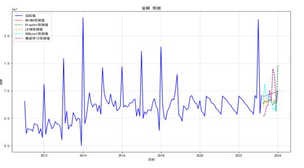

# 时间序列预测在销售数据分析中的应用

## 引言

时间序列预测是数据分析中的重要技术，通过研究历史数据来预测未来趋势。在香烟销量预测项目中，我应用了多种时间序列模型进行销售数据分析和预测，本文将分享相关的实践经验。

## 数据预处理

### 异常值处理
在销售数据中，异常值可能由数据录入错误、系统故障或特殊事件导致。处理异常值的方法包括：

- **统计方法**：使用3σ原则识别异常值
- **可视化方法**：通过箱线图、散点图等识别异常点
- **领域知识**：结合业务逻辑判断异常值的合理性

在项目中，我对品牌A1-A4的历史销售数据进行了异常值检测和处理，确保数据质量。

### 缺失值处理
缺失值处理是时间序列分析的重要环节：

- **前向填充**：使用前一个值填充
- **后向填充**：使用后一个值填充
- **插值方法**：线性插值、样条插值等
- **删除策略**：对于缺失率过高的数据点，考虑删除

## 时间序列模型

### ARIMA模型
ARIMA（自回归积分滑动平均模型）是经典的时间序列预测模型：

**模型特点**：
- 适用于平稳时间序列
- 能够捕捉数据的自相关关系
- 参数可解释性强

**应用实践**：
在项目中，我使用ARIMA模型对品牌A1-A4的销售数据进行预测，通过调整参数（p, d, q）来优化模型性能。

### Prophet模型
Prophet是Facebook开发的时间序列预测工具：

**优势**：
- 自动处理季节性
- 对缺失值和异常值有较好的鲁棒性
- 易于使用和调参

**应用场景**：
Prophet特别适合具有明显季节性和趋势的销售数据，在品牌A5的销售额预测中表现良好。

### LSTM模型
LSTM（长短期记忆网络）是深度学习中常用的时间序列模型：

**特点**：
- 能够捕捉长期依赖关系
- 对非线性关系有较强的拟合能力
- 需要较多的训练数据

**实现过程**：
1. 数据标准化
2. 构建时间窗口
3. 设计LSTM网络结构
4. 训练和验证模型

在项目中，LSTM模型在捕捉销售数据的复杂模式方面表现出色。

### XGBoost模型
XGBoost是梯度提升算法，在时间序列预测中也有广泛应用：

**优势**：
- 特征重要性分析
- 处理非线性关系
- 训练速度快

**特征工程**：
- 时间特征：年、月、日、星期等
- 滞后特征：前N期的销售数据
- 统计特征：移动平均、标准差等

## 集成学习方法

### 为什么需要集成学习
单一模型往往存在局限性：
- 不同模型捕捉的数据特征不同
- 单一模型可能过拟合或欠拟合
- 集成学习能够综合多个模型的优势

### 元学习器设计
在项目中，我使用线性回归作为元学习器：

**集成流程**：
1. 使用ARIMA、Prophet、LSTM、XGBoost分别进行预测
2. 将四个模型的预测结果作为特征
3. 使用线性回归模型学习各模型的权重
4. 生成最终的集成预测结果

**优势**：
- 线性回归简单高效
- 能够学习各模型的最优权重
- 可解释性强

## 模型评估

### 评估指标
- **MAE（平均绝对误差）**：衡量预测误差的平均大小
- **RMSE（均方根误差）**：对大误差更敏感
- **MAPE（平均绝对百分比误差）**：相对误差指标

### 实验结果
实验表明，集成学习模型的预测精度显著优于单一模型：
- 能够更有效地捕捉销售数据的复杂特性
- 在不同品牌的数据上都表现稳定
- 预测误差明显降低

## 项目成果

该项目获得了**钉钉杯数模比赛三等奖**，是对我时间序列预测能力的认可。通过这个项目，我：

- 深入理解了时间序列预测的原理和方法
- 掌握了多种预测模型的实现和调优
- 学会了集成学习在预测任务中的应用
- 提升了Python编程和数据处理能力

## 总结

时间序列预测在销售数据分析中具有重要价值。通过合理的数据预处理、模型选择和集成学习，我们能够获得更准确的预测结果。在实际应用中，需要根据数据特点选择合适的模型，并通过集成学习进一步提升预测性能。

对于想要学习时间序列预测的同学，建议从ARIMA等经典模型开始，逐步学习深度学习方法，最后掌握集成学习技术，形成完整的技术栈。
