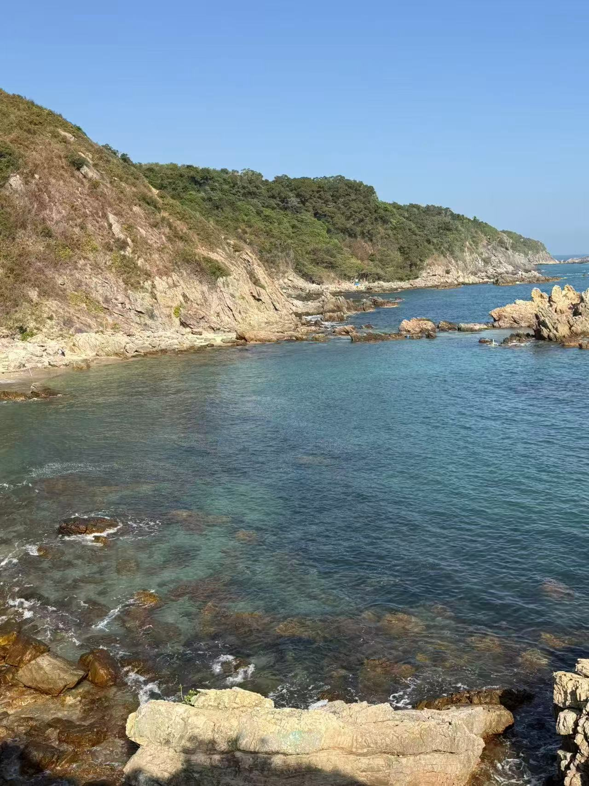
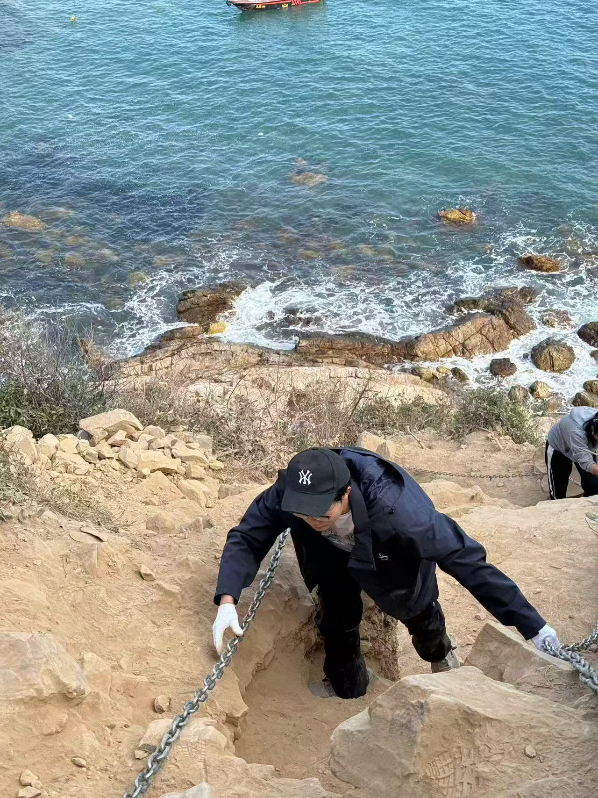
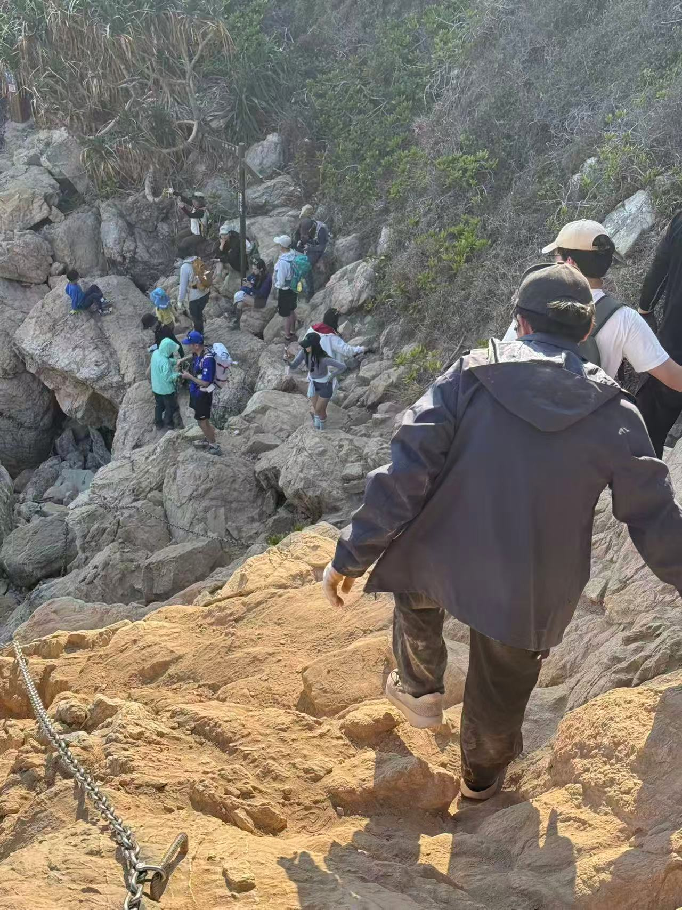
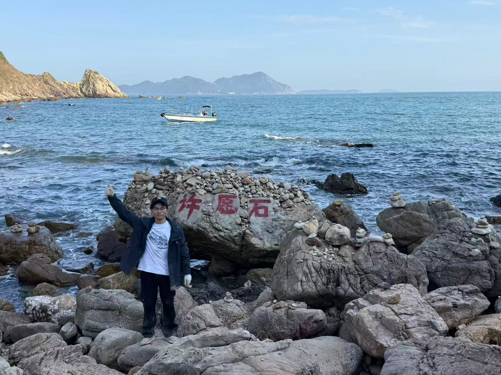
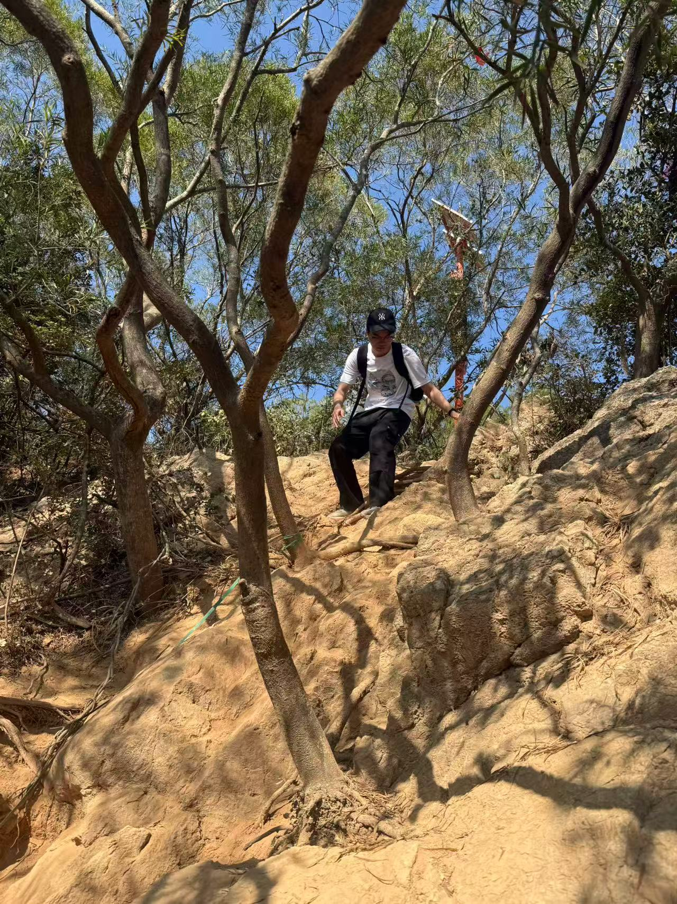
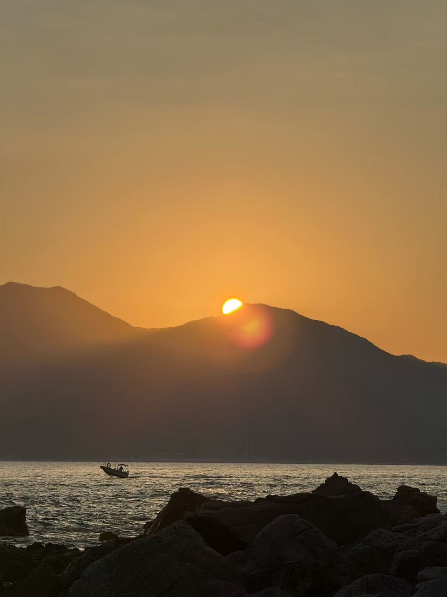
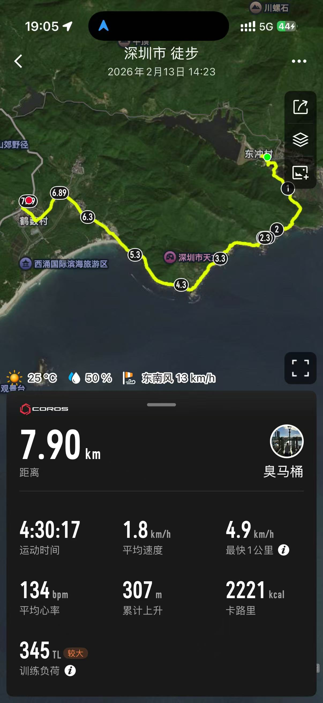

# 东涌到西涌徒步记录

2026 年 2 月 13 日，我从深圳东涌村出发，完成了到西涌的海岸线穿越。全程 7.9 公里，运动时间 4 个半小时，翻越了4个山头，累计上升 307 米，平均心率 134 次/分。

## 一、东涌起点

早上从东涌村出发，沿着海岸线走。海水是蓝绿色的，能清楚看到水下的礁石，浪拍在石头上溅起白泡。当天 25℃，比较晒，空气里有海的咸味。脚下的石头被海水泡得很凉，有的地方很滑，不过还好鞋很防滑，得小心走。

## 二、铁链路段

中途有几段需要抓铁链的陡坡，石头被海风磨得很光滑，脚下是松软的沙土。我戴着5元买的白手套，攥着铁链往上爬，手臂开始反酸。前面有人开路，后面有人提醒「踩稳」，这段路走得慢，每一步都要找好落脚点。

有一段路，我几乎是手脚并用，膝盖抵着粗糙的岩石，手套上沾满了泥土和沙砾。当终于爬上一处高地，回头望去，海岸线在脚下蜿蜒，海浪在远处翻涌。
## 三、许愿石

走到一块刻着「许愿石」的大石头，石头上堆了很多小玛尼堆，我同伴和我说要叠奇数的石头，我也在旁边叠了3块石头。远处海面有几艘小船慢慢开，天很蓝，海和天的界限很清楚。

## 四、林间土路

离开海岸线后，钻进了一段林间土路。路很窄，树根盘在地上，阳光透过树叶洒下来，地上有斑驳的影子。脚下的土很松，有的地方滑，得抓着旁边的树干走。能听到远处的海浪声，风里有草木的味道。

## 五、西涌终点

抵达西涌时，夕阳将海面染成金色，小船划过留下金色轨迹。回望来路，陡坡、土路皆成过往，平均 1.8 公里 / 小时的速度虽慢，却每一步都扎实有力。这让我们明白：干事创业要涵养 “功成不必在我” 的境界，秉持 “功成必定有我” 的担当。不必纠结于一时的速度与成效，而要以实干实绩书写人生华章，让每一次前行都成为推动事业发展的坚实力量

## 六、收尾

这次徒步平均速度 1.8 公里/小时，走得不算快，但每一步都很扎实。路上遇到不少同路的人，小的只有7岁。整体感觉很累但任有余力，总算把一段路走完了。
